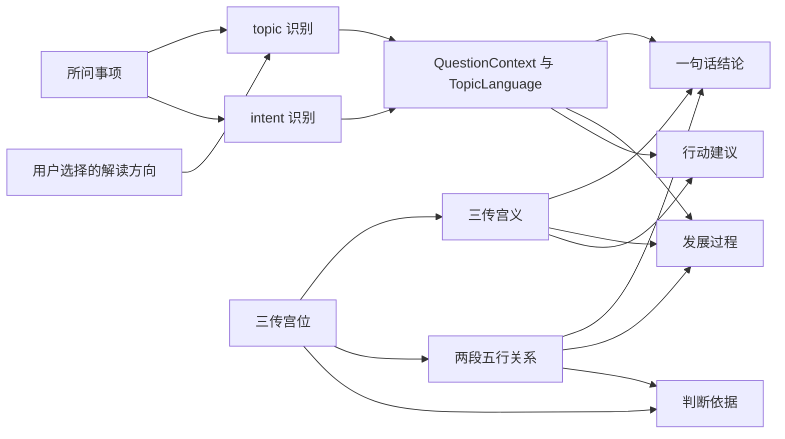

# 内置解说程序说明

本文以当前 `src` 源码为准，描述内置白话解说和 AI 提示词导出的真实行为。它不说明已保留但未接入页面的历史 AI 请求代码。

## 1. 实际入口

### 文件与职责

| 文件 | 职责 | 对外导出 |
|---|---|---|
| `src/features/divination/interpretation.ts` | 汇总解说、计算相邻两传五行关系 | `ElementRelation`、`ElementTransition`、`elementGenerates`、`elementControls`、`describeElementRelation()`、`createDivinationInterpretation()`；转出 `detectInterpretationDirection()`、`interpretationDirections`、`parseQuestion()`、`InterpretationDirection`、`generateStageInterpretations()`、`synthesizeOverallTrend()` |
| `src/features/divination/questionContext.ts` | topic、intent、解读方向与 topic 语境 | `interpretationDirections`、`InterpretationDirection`、`Topic`、`Intent`、`QuestionContext`、`topicRecognitionRules`、`intentRecognitionRules`、`detectInterpretationDirection()`、`parseQuestion()`、`TopicLanguage`、`topicLanguage()` |
| `src/features/divination/interpretationNarrative.ts` | 整体走势、结论、三阶段和关键转折 | `Passes`、`Transitions`、`describeOverallTrajectory()`、`synthesizeOverallTrend()`、`generateStageInterpretations()`、`generateTurningPoints()` |
| `src/features/divination/palaceSemantics.ts` | 九宫按初传/中传/末传配置宫义与建议 | `PalaceSemantics`、`palaceSemantics` |
| `src/components/DivinationInterpretation.tsx` | 渲染方向选择、结论、发展过程、关键转折、建议、依据 | `DivinationInterpretation` |
| `src/features/ai/aiPrompt.ts` | 把程序排盘、原问题、topic、intent 和用户补充问题合成可复制提示词 | `AiPromptContext`、`buildAiInterpretationPrompt()` |
| `src/components/LocalGeminiInterpretation.tsx` | 复制提示词并打开外部 AI 网站 | `LocalGeminiInterpretation` |

`src/app/App.tsx` 的 `ResultView` 先用 `detectInterpretationDirection(question)` 初始化选择项，再在结果区调用：

```tsx
<DivinationInterpretation
  passes={passes}
  direction={direction}
  question={question}
  onDirectionChange={setDirection}
/>
```

组件内部的实际生成调用是：

```ts
const interpretation = createDivinationInterpretation(passes, direction, question)
```

## 2. 完整处理流程



代码顺序是：`parseQuestion()` → 两次 `describeElementRelation()` → `synthesizeOverallTrend()` → `generateStageInterpretations()` → `generateTurningPoints()` → 宫位建议加 topic 行动文案 → evidence 数组。

## 3. 输入和输出

### 输入

`createDivinationInterpretation()` 的真实签名是：

```ts
export function createDivinationInterpretation(
  passes: Passes,
  direction?: InterpretationDirection,
  question = '',
)
```

相关真实类型如下：

```ts
export type Passes = readonly [Palace, Palace, Palace]

export interface Palace {
  readonly index: number
  readonly name: string
  readonly element: Element
  readonly direction?: string
  readonly deity?: string
  readonly keywords: readonly string[]
}

export const interpretationDirections = [
  '综合', '感情', '工作/事业', '财运', '健康', '出行', '寻物', '学业',
] as const
export type InterpretationDirection = typeof interpretationDirections[number]
```

`passes` 必须是已由程序计算完成的初传、中传、末传；生成器不重新起课。`direction` 若传入则覆盖问题自动分类，页面总会把当前选择传入。`question` 参与 topic/intent 和求职语境识别。

### 输出

源码没有声明命名的 `DivinationInterpretation` 接口；输出类型由 `createDivinationInterpretation()` 推断，可用 `ReturnType<typeof createDivinationInterpretation>` 取得。展开后的实际结构是：

```ts
{
  context: QuestionContext
  summary: string
  passReadings: readonly string[]
  transitions: readonly [ElementTransition, ElementTransition]
  turningPoints: readonly string[]
  advice: string
  evidence: string[]
}
```

其中：

| 字段 | 页面位置 |
|---|---|
| `context` | 不直接显示；控制解说用词，并写入 AI 提示词的 topic/intent |
| `summary` | “一句话结论” |
| `passReadings` | “发展过程”，按前期、过程、结果各一段 |
| `transitions` | 不单独遍历显示；用于结论、阶段和依据生成 |
| `turningPoints` | “关键转折” |
| `advice` | “行动建议” |
| `evidence` | “判断依据”列表 |

## 4. topic 和 intent 识别

### topic 与实际关键词

自动识别按 `topicRecognitionRules` 从上到下查找，第一个匹配项生效：

| 优先级 | 解读方向 / topic | 实际正则关键词 |
|---:|---|---|
| 1 | 寻物 | `寻物、找回、丢失、丢了、遗失、失物、不见、找不到` |
| 2 | 健康 | `健康、身体、生病、病情、症状、医院、检查、治疗、手术、疼、痛、康复` |
| 3 | 感情 | `感情、恋爱、结婚、婚姻、复合、分手、对象、伴侣、喜欢、表白、相亲、关系` |
| 4 | 学业 | `学业、学习、考试、考研、考公、升学、成绩、论文、学校` |
| 5 | 财运 | `财运、投资、股票、基金、理财、赚钱、收入、回款、收益、借钱、还款、债务` |
| 6 | 工作/事业 → 内部 topic“工作” | `工作、事业、求职、岗位、职位、面试、待遇、升职、跳槽、创业、项目、客户、同事、老板、公司` |
| 7 | 出行 | `出行、旅行、旅游、出差、行程、航班、车票、远行` |
| 默认 | 综合 | 无匹配 |

`学业`没有出现在 `topicRecognitionRules` 末尾以外的额外规则；`综合`也没有关键词。页面初始化自动识别后，用户可以改选方向。显式 `direction` 优先于自动识别；即使问题写“工作”，用户选“感情”后内部 topic 也会是“感情”。

实际函数是：

```ts
export function detectInterpretationDirection(question: string): InterpretationDirection {
  return topicRecognitionRules.find(([, pattern]) => pattern.test(question))?.[0] ?? '综合'
}

export function parseQuestion(question = '', direction?: InterpretationDirection): QuestionContext {
  const normalized = question.trim()
  const selected = direction ?? detectInterpretationDirection(normalized)
  const topic = selected === '工作/事业' ? '工作' : selected
  const intent: Intent = intentRecognitionRules.find(([, pattern]) => pattern.test(normalized))?.[0] ?? 'trend'
  return { question: normalized, topic, intent }
}
```

### intent

| 优先级 | intent | 实际关键词 |
|---:|---|---|
| 1 | `timing` | `什么时候、何时、多久` |
| 2 | `advice` | `怎么、如何、怎么办` |
| 3 | `outcome` | `是否、能否、会不会、可以吗、成功吗` |
| 默认 | `trend` | 其他所有问题，包括空问题 |

“最近、未来、走势、运势”没有专门正则；它们因未匹配前三类而落入 `trend`。多个 intent 同时出现时按表中优先级处理，例如“是否能成功，何时有结果”为 `timing`。

## 5. 九宫解说配置

六宫复用同名六宫的这套配置。宫位配置本身不按 topic 分叉；八种 topic 的专用语境集中在 `questionContext.ts` 的 `languages`。另有一个求职特例：topic 为工作且原问题命中 `求职、岗位、职位、面试、待遇、跳槽、找工作` 时，`topicLanguage()` 返回求职专用字段。

| 宫位 | 初传含义 | 中传含义 | 末传含义 | 建议 | 宫内 topic 专用文案 |
|---|---|---|---|---|---|
| 大安 | 开始有一定基础，可以按已有安排推进 | 过程趋于平稳，但进度可能偏慢 | 后期更可能保持现状，适合逐步积累 | 可以保留有效的安排，设一个小目标并定期检查进度。 | 无 |
| 留连 | 开始可能已有未解决的问题，迟迟难以动身 | 中途容易拖延和反复，旧问题可能再次占用精力 | 后期可能仍有牵绊，暂时难以彻底收尾 | 可以列出卡住的事项，先解决最影响进度的一项，并约定复查时间。 | 无 |
| 速喜 | 开始可能很快出现消息或机会，需要及时确认 | 中途可能突然加快，出现让人振奋的进展 | 后期可能较快得到积极反馈，但仍需确认是否落实 | 可以及时核实新消息，确认条件后先做一小步，避免仓促承诺。 | 无 |
| 赤口 | 开始容易有意见分歧，沟通时可能带着情绪 | 中途容易因说法或利益不同发生摩擦 | 后期可能演变成争执或关系紧张，需要留意冲突 | 可以先核对事实，把分歧逐项写清；情绪激动时暂停沟通，必要时请第三方协助。 | 无 |
| 小吉 | 开始可能有小机会或有限帮助，可以先尝试 | 过程中可能得到配合，逐步取得小进展 | 后期可能有小收获，但不宜把规模想得过大 | 可以从成本较低的尝试开始，确认效果后再扩大，并感谢实际提供帮助的人。 | 无 |
| 空亡 | 开始可能缺少可靠条件，想法与实际还有距离 | 中途可能发现承诺未兑现或投入没有着落 | 后期存在落空或收获不足的可能，需要准备替代方案 | 可以先核实人、物和承诺是否到位，设定投入上限，并准备备用安排。 | 无 |
| 病符 | 开始可能已有异常或负担，需要先检查薄弱处 | 中途可能因旧问题消耗精力，需要修整 | 后期可能仍需修复和调整，难以一下恢复顺畅 | 可以先暂停过度消耗，记录异常并逐项排查；涉及身体不适时应按症状就医。 | 无 |
| 桃花 | 开始可能受到人际吸引或个人欲望推动 | 中途容易受人情和牵挂影响，注意力可能分散 | 后期可能留下人际牵绊，需分清期待与实际承诺 | 可以把个人好感与实际条件分开核实，明确彼此边界和承诺。 | 无 |
| 天德 | 开始可能有经验人士或较好条件支持 | 中途可能获得指点或协调，帮助缓解难处 | 后期可能得到支持而有所改善，仍需自己落实 | 可以带着具体问题向有经验的人求助，把得到的建议落实为可检查的步骤。 | 无 |

叙事文件还另有私有 `outlook` 配置，为每宫提供 `state`、`ending`、`pace` 和 `kind`。它服务于总体走势和结论，不从 `palaceSemantics` 自动推导，因此修改宫义时需要同时核对两处。

## 6. 五行关系

程序用两个映射定义相生、相克：

```ts
export const elementGenerates: Readonly<Record<Element, Element>> = Object.freeze({
  木: '火', 火: '土', 土: '金', 金: '水', 水: '木',
})
export const elementControls: Readonly<Record<Element, Element>> = Object.freeze({
  木: '土', 土: '水', 水: '火', 火: '金', 金: '木',
})
```

方向判断的真实实现是：

```ts
export function describeElementRelation(from: Element, to: Element): ElementTransition {
  if (from === to) return { from, to, relation: '同类', description: `同属${from}：趋势可能延续或加强，并不一定代表变好` }
  if (elementGenerates[from] === to) return { from, to, relation: '相生', description: `${from}生${to}：前一阶段可能推动后一阶段，也可能让原有问题继续发展` }
  if (elementControls[from] === to) return { from, to, relation: '相克', description: `${from}克${to}：前期因素可能压制后续发展，使下一步不易展开` }
  if (elementGenerates[to] === from) return { from, to, relation: '受生', description: `${to}生${from}：后续条件可能对前面形成补充，让原有状态得到支撑` }
  return { from, to, relation: '受克', description: `${to}克${from}：后续变化可能反制原有状态，原来的安排可能需要调整` }
}
```

对应关系为：

| 实际方向 | `relation` | 文字角度 |
|---|---|---|
| 同五行 | `同类` | 趋势可能延续或加强 |
| 前传生后传 | `相生` | 前一阶段推动后一阶段，也可能推动问题 |
| 前传克后传 | `相克` | 前期因素压制后续发展 |
| 后传生前传 | `受生` | 后续条件补充前面 |
| 后传克前传 | `受克` | 后续变化反制原有状态 |

同一个 relation 还分别进入 `summaryLinks`、`stageLinks` 和 `turningLinks`，因此结论、发展过程和关键转折使用不同句式。`createDivinationInterpretation()` 固定计算初→中、中→末两段，不改变传序。

## 7. 一句话结论生成

当前结论是“规则选择加字符串模板合成”。它不是生成式模型，也没有对自然语言问题做语义推理；它会选择整体走势模板、intent 模板、末传 `outlook`、两段 `summaryLinks` 和 topic 成立条件，然后插入同一个两句模板：

```ts
return `就${language.subject}而言，整体呈现${describeOverallTrajectory(passes)}，${response}${intentEnding}。关键转折在于${summaryLinks[transitions[0].relation][0]}，而${summaryLinks[transitions[1].relation][1]}；这一倾向是否落实，还要看${language.condition}。`
```

`describeOverallTrajectory()` 的选择优先级如下，命中即返回：

1. 三传全同。
2. 初传与中传同宫。
3. 中传与末传同宫。
4. 固定组合空亡→小吉→大安。
5. 固定组合大安→留连→赤口。
6. 初传速喜且中传留连，或末传大安。
7. 中传留连且末传大安。
8. 初传为 difficulty、末传为 support，再按中传是否 support 分叉。
9. 初传为 support、末传为 difficulty，再按中传是否 difficulty 分叉。
10. 初末同宫。
11. 中传 difficulty、末传 support。
12. 三传全为 support。
13. 三传全为 difficulty。
14. 中传为 support。
15. 默认“推进与牵绊交错”。

`outlook.kind` 当前把大安、速喜、小吉、天德列为 `support`；留连、赤口、空亡、病符列为 `difficulty`；桃花列为 `mixed`。

结论不会直接 `join(passReadings)`，测试也检查结论不等于阶段拼接。不过机械感仍然存在：所有组合最终都套用同一两句骨架，部分轨迹共用宽泛模板；结论中的末传倾向、关系含义和成立条件，会与发展过程以不同句子重复相同语义。这是模板信息重叠，不是完全相同句子的复制。

## 8. 发展过程生成

`generateStageInterpretations()` 返回固定三个字符串：

- 前期调用 `meaning(first).first`，再调用私有 `manifestation(first, context)` 加 topic 表现，最后加入 `TopicLanguage.verify`。
- 过程通常调用 `meaning(middle).middle`；若初中同宫则改为延续说明。随后调用 `manifestation(middle, context)`、初→中的 `stageLinks[relation][0]`，再按 intent 生成观察项。
- 结果通常调用 `meaning(last).last`；若中末同宫则改为延续说明，三传全同则改为强化说明。随后调用中→末的 `stageLinks[relation][1]`，再按 intent 生成成立条件或时间提醒。

问题原文会先用于 topic、intent；此外，只有工作 topic 的求职正则会再次检查完整 `context.question`，切换到求职专用用词。其他人物、事件细节不会进入文案。例如“家人的治疗情况会怎样”中的“家人”不会出现在输出，只会因“治疗”识别为健康；“会怎样”也不匹配 outcome，最终是默认 trend。

连续同宫只比较宫名：`first.name === middle.name` 控制过程段延续说明，`middle.name === last.name` 控制结果段延续说明；两者同时成立时结果段说明“主题持续且被明显强化”。五行仍按实际元素计算，同宫通常也是同五行。

## 9. 完整实例追踪

以下案例直接运行当前 `createDivinationInterpretation()` 得到，均使用 `xunNineRules` 的宫位对象，没有改写输出。

### 案例 A：空亡→小吉→大安，“这次换工作能成功吗”

输入：

- `passes`：空亡（土，失去/虚伪/空想）→小吉（水，起步/不多/尚可）→大安（木，长期/缓慢/稳定）。
- `direction`：`undefined`，由问题自动识别。
- `question`：`这次换工作能成功吗`。

中间判断：

1. `detectInterpretationDirection()` 命中“工作”，返回 `工作/事业`。
2. `parseQuestion()` 将内部 topic 规范为 `工作`；“成功吗”命中 `outcome`。
3. 求职特例正则不包含“换工作”（只包含“跳槽”和“找工作”等），所以 `topicLanguage()` 使用一般工作字段。
4. 初→中为土克水，relation 是 `相克`；中→末为水生木，relation 是 `相生`。
5. `describeOverallTrajectory()` 命中固定组合，返回“先虚后实、由小到稳”。

最终输出：

```text
context：{"question":"这次换工作能成功吗","topic":"工作","intent":"outcome"}

summary：就工作推进而言，整体呈现先虚后实、由小到稳，若问能否达成，目前较有可能缓慢落实并保持稳定。关键转折在于起初的条件仍可能限制中途推进，而中途状态可能推动收尾走向；这一倾向是否落实，还要看职责与资源明确，后续安排得到实际执行。

passReadings[0]：前期：开始可能缺少可靠条件，想法与实际还有距离。结合工作推进，可能体现为任务条件和职责安排的信息不完整，或预期缺少实际依据。需要核实任务范围、负责人和可用资源是否清楚。

passReadings[1]：过程：过程中可能得到配合，逐步取得小进展；在本问题中，可能表现为沟通与交付进展有少量可验证的改善，但范围可能有限。初传克中传，起初未解决的因素可能限制新进展，出现反馈也未必能顺利推进。观察沟通与交付进展是否足以支持所期待的结果，而非只听到口头说法。

passReadings[2]：结果：就工作落实的持续性看，后期更可能保持现状，适合逐步积累。中传生末传，中途积累可能促成这一倾向，但不等于结果必然有利。能否达到预期仍以职责与资源明确，后续安排得到实际执行为条件，不能直接断定能或不能。

transitions[0]：{"from":"土","to":"水","relation":"相克","description":"土克水：前期因素可能压制后续发展，使下一步不易展开"}
transitions[1]：{"from":"水","to":"木","relation":"相生","description":"水生木：前一阶段可能推动后一阶段，也可能让原有问题继续发展"}

turningPoints[0]：初→中（空亡→小吉）：条件尚未落实转向小进展开始出现；前段对后段有约束，突破点在于找出并处理限制条件。
turningPoints[1]：中→末（小吉→大安）：小进展开始出现转向基础逐步稳固；前段给后段提供助力，应分清被推动的是机会还是隐患。

advice：可以从成本较低的尝试开始，确认效果后再扩大，并感谢实际提供帮助的人。可以保留有效的安排，设一个小目标并定期检查进度。可以把负责人、交付内容和期限写清，先确认一项能验收的成果。

evidence[0]：宫位：初传空亡（土）、中传小吉（水）、末传大安（木）。
evidence[1]：宫义关键词：空亡：失去、虚伪、空想；小吉：起步、不多、尚可；大安：长期、缓慢、稳定。
evidence[2]：五行：初→中 土克水：前期因素可能压制后续发展，使下一步不易展开；中→末 水生木：前一阶段可能推动后一阶段，也可能让原有问题继续发展。
evidence[3]：以上为传统象义的解释，不代表现实因果；涉及健康、法律、投资时，需依据事实和专业意见作判断。
```

这里有一个真实细节：问题中的“换工作”没有触发求职特例，所以输出使用一般工作语境的“工作推进”，而不是“求职进展”。原因是当前 `topicLanguage()` 的求职正则包含“跳槽”和“找工作”，但不包含“换工作”；自动 topic 识别仍因“工作”成功。

### 案例 B：病符→速喜→桃花，“家人的治疗情况会怎样”

输入：

- `passes`：病符（土，病态/异常/治疗）→速喜（火，惊喜/快速/突然）→桃花（土，欲望/牵绊/异性）。
- `direction`：`undefined`。
- `question`：`家人的治疗情况会怎样`。

中间判断：

1. topic 正则命中“治疗”，得到 `健康`。
2. “会怎样”不在 outcome 正则中，也不命中 timing/advice，因此 intent 为默认 `trend`。
3. 初→中：后传火生前传土，relation 为 `受生`；中→末：前传火生后传土，relation 为 `相生`。
4. 整体走势不命中前面的固定组合；中传速喜为 support，命中“中途虽有改善窗口……”模板。

最终输出：

```text
context：{"question":"家人的治疗情况会怎样","topic":"健康","intent":"trend"}

summary：就恢复过程而言，整体呈现中途虽有改善窗口，仍需防止短暂进展被后续牵制，后续可能仍受人情与期待牵动，需要厘清边界。关键转折在于中途条件可能补足前期基础，而中途状态可能推动收尾走向；这一倾向是否落实，还要看医生评估支持这一判断，且症状与复查信息相互印证。

passReadings[0]：前期：开始可能已有异常或负担，需要先检查薄弱处。结合恢复过程，可能体现为症状记录和检查信息中存在需要排查的异常，额外消耗了时间和精力。需要核实症状持续多久、是否变化，以及医生如何解释检查结果。

passReadings[1]：过程：中途可能突然加快，出现让人振奋的进展；在本问题中，可能表现为检查结果与治疗反馈较快出现，尚需分清消息与实际落实。中传生初传，新条件可能先用于补足原来的基础，未必立刻体现为向前推进。应观察检查结果与治疗反馈是否连续出现，避免把一次波动当成长期变化。

passReadings[2]：结果：就恢复情况的持续变化看，后期可能留下人际牵绊，需分清期待与实际承诺。中传生末传，中途积累可能促成这一倾向，但不等于结果必然有利。这一走向需要医生评估支持这一判断，且症状与复查信息相互印证才有现实依据，否则还应重新评估。

transitions[0]：{"from":"土","to":"火","relation":"受生","description":"火生土：后续条件可能对前面形成补充，让原有状态得到支撑"}
transitions[1]：{"from":"火","to":"土","relation":"相生","description":"火生土：前一阶段可能推动后一阶段，也可能让原有问题继续发展"}

turningPoints[0]：初→中（病符→速喜）：薄弱处需要修整转向反馈突然加快；补充作用来自后段，应检查新资源是否真正补上旧缺口。
turningPoints[1]：中→末（速喜→桃花）：反馈突然加快转向牵挂影响判断；前段给后段提供助力，应分清被推动的是机会还是隐患。

advice：可以及时核实新消息，确认条件后先做一小步，避免仓促承诺。可以把个人好感与实际条件分开核实，明确彼此边界和承诺。记录症状和治疗反馈，按医生安排检查或复诊；本解读不能代替医生诊断，也不能据此调整治疗。

evidence[0]：宫位：初传病符（土）、中传速喜（火）、末传桃花（土）。
evidence[1]：宫义关键词：病符：病态、异常、治疗；速喜：惊喜、快速、突然；桃花：欲望、牵绊、异性。
evidence[2]：五行：初→中 火生土：后续条件可能对前面形成补充，让原有状态得到支撑；中→末 火生土：前一阶段可能推动后一阶段，也可能让原有问题继续发展。
evidence[3]：以上为传统象义的解释，不代表现实因果；涉及健康、法律、投资时，需依据事实和专业意见作判断。
```

该输出暴露了当前模板的边界：桃花宫的通用末传与建议直接带入健康语境，出现“人际牵绊”“个人好感”等用词；程序没有健康 topic 下的桃花专用宫义。问题中的“家人”没有被理解或复述。

## 10. 当前限制与后续修改入口

### 当前限制

- `palaceSemantics`、私有 `outlook`、`languages`、求职特例、三套五行叙事映射和整体走势模板全部硬编码。
- 解析只做不区分词边界的正则包含匹配，不理解否定、指代、人物关系、上下文、同义词或问题主次。“会怎样”不会识别为 outcome；“换工作”不会触发求职专用文案。
- 用户手选方向会覆盖自动 topic，即使与问题文本冲突；intent 始终从原问题解析。
- 一个问题命中多个 topic 时只取 `topicRecognitionRules` 中最先出现的类别。
- 总结模板和阶段模板避免了完整句复制，但会重复末传倾向、五行方向和现实成立条件的语义。
- 非固定组合大量合并到按 `support/difficulty/mixed` 选择的宽泛走势，不能表达所有宫位顺序的独特差别。
- 宫位配置没有按 topic 改写。病符、桃花等通用宫义放入不相干 topic 时可能显得生硬；案例 B 即为真实例子。
- `advice` 直接拼接去重后的中传、末传宫位建议和 topic 行动建议，是明确的字符串拼接，跨语境时可能机械或冲突。
- `evidence` 会保留六宫与九宫各自实际元素和关键词；同名宫位在两体系中的关键词、留连五行并不完全相同。

### 修改入口

| 调整目标 | 文件 | 配置或函数 |
|---|---|---|
| 某宫初/中/末含义和宫位建议 | `src/features/divination/palaceSemantics.ts` | `palaceSemantics` |
| 某宫用于总结的状态、末传倾向、速度或支持/困难分类 | `src/features/divination/interpretationNarrative.ts` | 私有 `outlook` |
| 某 topic 的基础、反馈、核实项、成立条件和行动文案 | `src/features/divination/questionContext.ts` | 私有 `languages`、`topicLanguage()` |
| topic 分类、关键词与优先级 | `src/features/divination/questionContext.ts` | `topicRecognitionRules`、`detectInterpretationDirection()` |
| intent 分类、关键词与优先级 | `src/features/divination/questionContext.ts` | `parseQuestion()` |
| 整体走势组合与优先级 | `src/features/divination/interpretationNarrative.ts` | `describeOverallTrajectory()` |
| 一句话结论骨架、intent 回答方式、五行摘要措辞 | `src/features/divination/interpretationNarrative.ts` | `synthesizeOverallTrend()`、私有 `summaryLinks` |
| 三阶段结构、现实表现和阶段五行措辞 | `src/features/divination/interpretationNarrative.ts` | `generateStageInterpretations()`、私有 `manifestation()`、`stageLinks` |
| 关键转折 | `src/features/divination/interpretationNarrative.ts` | `generateTurningPoints()`、私有 `turningLinks` |
| 五行生克判定和判断依据文字 | `src/features/divination/interpretation.ts` | `elementGenerates`、`elementControls`、`describeElementRelation()`、`createDivinationInterpretation()` |
| AI 导出字段和约束 | `src/features/ai/aiPrompt.ts` | `AiPromptContext`、`buildAiInterpretationPrompt()` |

调整任何宫义时应同时检查 `palaceSemantics` 与 `outlook`；调整五行文字时应同时检查 `describeElementRelation()`、`summaryLinks`、`stageLinks` 和 `turningLinks`，避免页面不同区块对同一关系给出冲突表述。

## 六宫口诀与具体事项解说

六宫专用数据位于 `src/features/divination/sixPalaceKnowledge.ts`。每宫保存口诀原文、现代解释和 `specificTopicMeanings`；后者将口诀转成可核实的现代事项语义，而不是把原文拼接进结论。

- `lostProperty`、`travelerMessage`、`wealth`、`dispute`、`relationship`、`health` 的关键词集中在 `questionContext.ts` 的 `specificTopicKeywords`。
- `classifySixQuestion()` 返回具体事项后，`createSixPalaceInterpretation()` 分别用初传 `initial`、中传 `process`、末传 `outcome` 生成三段，并保留五行与阴阳关系；`action` 生成可执行建议。
- `traditionalHint` 单独作为“传统提示”显示，不与现实行动建议混写。寻物提示的方位／时段仅供扩大排查范围，不能保证找回；空亡不输出“永远找不到”。
- 健康具体事项只描述处理节奏与信息状态，始终附带医学免责声明；不把口诀中的痊愈、无妨、灾殃、恶鬼等写入现代解说。

口诀、天干地支、象数、方位及时段属于展示或解说资料，不参与 `calculateThreePasses()`。基础属性仍以当前六宫配置为准：留连为土／螣蛇，小吉为水／玄武。留连水／玄武、小吉六合、速喜“申午未”及求财方位的其他流派版本仅在规则页的流派说明中提示，不能覆盖落宫计算或五行关系。
